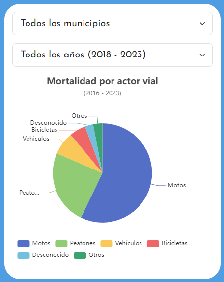
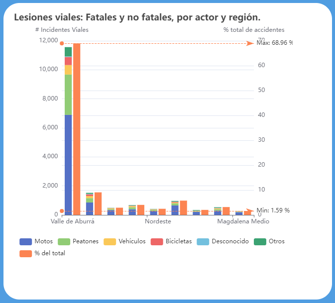
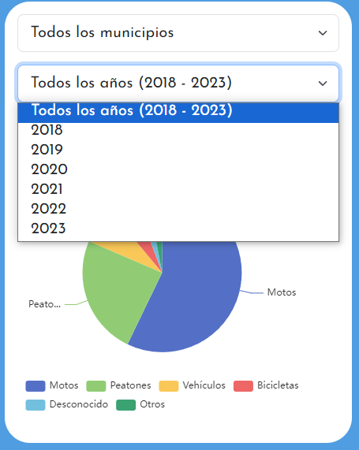
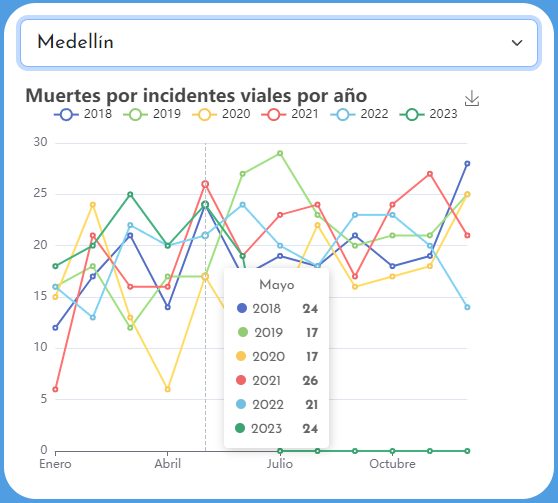
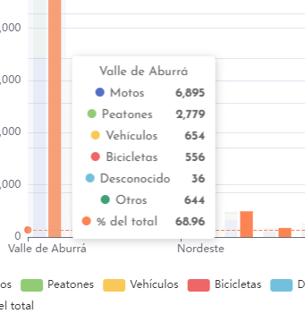

  

<h1 align="center">📉 Interactive & Open Dashboard 📈 </h1>

➡Link will be available soon.⬅

<h4 align="center">Dashboard displaying relevant data about accidents and their consequences in Antioquia, Colombia. Users can filter information by year and municipality to focus on specific locations and analyze data trends over time. </h4>

Data provided by <b>Gerencia de Seguridad Vial de Antioquia</b> (Road Safety Management of Antioquia), providing accurate and comprehensive information on accidents and related incidents in the region.

 
<h2 align="center">Previews & examples</h2>

  
  

    <b>There you can find basic & essential data</b>
  

<h3 align="center">To...</h3>

  

    <b>More Complex Data</b>
  

  

 

  

<h3 align="center">Perform data filtering...</h3>
  

    

 

The data will give you what you need

  

<h3 align="center">Interact with the Data</h3>

  
  
   

 

 Remove data if you want...

  

